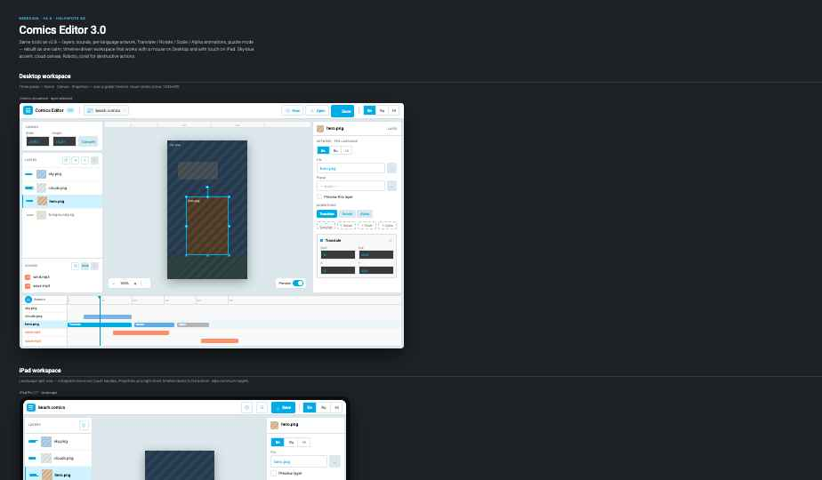
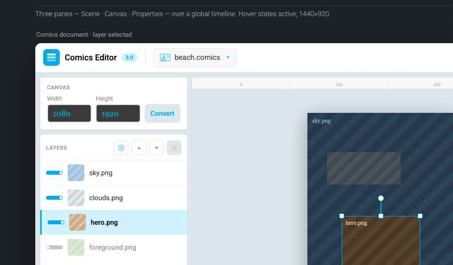

# Comics Editor

Comics Editor — приложение для создания анимированных комиксов и интерактивных пазлов: слои с покадровой анимацией, синхронизированный звук, многоязычный контент и настраиваемый холст. Один проект экспортируется в единый портативный файл, который затем воспроизводится в мобильных и десктопных приложениях через библиотеки **Comics Viewer**.

Работает на **Windows, macOS, Linux, iPhone/iPad и Android** (телефоны и планшеты) — один и тот же проект и формат файла на всех платформах.

## Скриншоты


*Desktop- и iPad-варианты интерфейса: слои, покадровая анимация, звук, многоязычный контент, таймлайн.*


*Три панели — Сцена · Холст · Свойства — поверх общего таймлайна.*

## Что умеет редактор

- **Два типа контента**:
  - **Comics** — вертикально прокручиваемая анимированная лента со звуком;
  - **Puzzle** — интерактивное поле-пазл с масштабированием (0.125×–1×) и перетаскиванием фрагментов.
- **Слои**: добавление, удаление, изменение порядка, включение/выключение видимости, выбор на холсте.
- **Многоязычный контент**: у каждого слоя — отдельная картинка (и всплывающая картинка) на язык; переключение языка в интерфейсе показывает нужный набор.
- **Анимации**: Translate (перемещение), Rotate (поворот), Scale (масштаб), Alpha (прозрачность) — с началом/концом на общей временной шкале; для слоя можно добавить несколько анимаций подряд.
- **Звук**: звуковые дорожки, привязанные к позиции на шкале, глобальное отключение звука.
- **Холст**: произвольные ширина/высота проекта, перетаскивание и трансформация слоя прямо на сцене (8 маркеров изменения размера + поворот).
- **Таймлайн**: отдельная дорожка на каждый слой/звук, полосы анимаций от начала до конца, перетаскиваемый плейхед для предпросмотра в любой момент.
- **Адаптивный интерфейс**: тот же редактор перестраивается под телефон, планшет и десктоп (полноэкранный холст на телефоне → панели «Сцена/Холст/Свойства» на десктопе).

## Формат файла

Проект сохраняется в единый файл **`.comics`** или **`.puzzle`** — самодостаточный пакет (артборды, звук, тайминги анимаций), который можно встроить в любое приложение или отправить как есть. Файлы не зависят от платформы, на которой были созданы или открыты.

По сути это **обычный `.zip`-архив** (без шифрования, `System.IO.Compression`/`ZipFile`, тот же формат, что у `7za.exe -tzip`) — переименуйте в `.zip` и распакуйте, чтобы посмотреть содержимое:

```
project.comics (= .zip)
├── data.json          # весь документ: тип (comics/puzzle), слои, анимации, тайминги, звук, локали
├── layers/             # картинки слоёв (и всплывающие картинки)
│   └── <name>_<scale>_<tileX>_<tileY>.<ext>
└── sounds/              # звуковые дорожки
    └── <name>.<ext>
```

- `data.json` — единственный файл с бизнес-данными; сериализуется/десериализуется той же C#-моделью что в редакторе (`Comics.Editor.Models`), плоский JSON, версионирования нет.
- Изображения нарезаны на тайлы фиксированного размера (512×512) на нескольких масштабах — для puzzle: `1.0, 0.5, 0.25, 0.125` (плюс превью-заглушка `ph_0_0`), для comics — только `1.0`. Имя файла кодирует масштаб и позицию тайла: `{name}_{scale}_{tileX}_{tileY}.{ext}`.
- `sounds/` — звуковые файлы как есть, без нарезки.

Читают этот формат Comics Viewer-библиотеки (см. ниже) — просто распаковывают zip и парсят `data.json`.

## Просмотр комиксов в своих приложениях (Comics Viewer)

Для интеграторов, которым нужно воспроизводить `.comics`/`.puzzle` в собственном продукте, доступны референсные библиотеки **Comics Viewer** — по одной под основные платформы. Каждая читает файлы локально (без сети), синхронизирует анимацию со звуком и открывается пятью основными методами API:

| Платформа | Библиотека | Репозиторий |
|---|---|---|
| Android | Comics Viewer Android | https://github.com/comics108/comics-viewer-android |
| iOS / macOS | Comics Viewer (Swift Package) | https://github.com/comics108/comics-viewer-ios |
| Flutter | Flutter Comics Viewer | https://github.com/comics108/flutter_comics_viewer |
| React Native | React Native Comics Viewer | https://github.com/comics108/react-native-comics-viewer |

Подробности установки и API — в README каждой библиотеки.

## Запуск несобранного (неподписанного) macOS-билда

Сборки из GitHub Actions подписаны ad-hoc (без Developer ID/нотаризации) — macOS блокирует скачанную копию Gatekeeper'ом. Снять карантинный атрибут вручную:

```bash
xattr -d com.apple.quarantine comics_editor.app
```

После этого приложение открывается обычным двойным щелчком без предупреждений.
